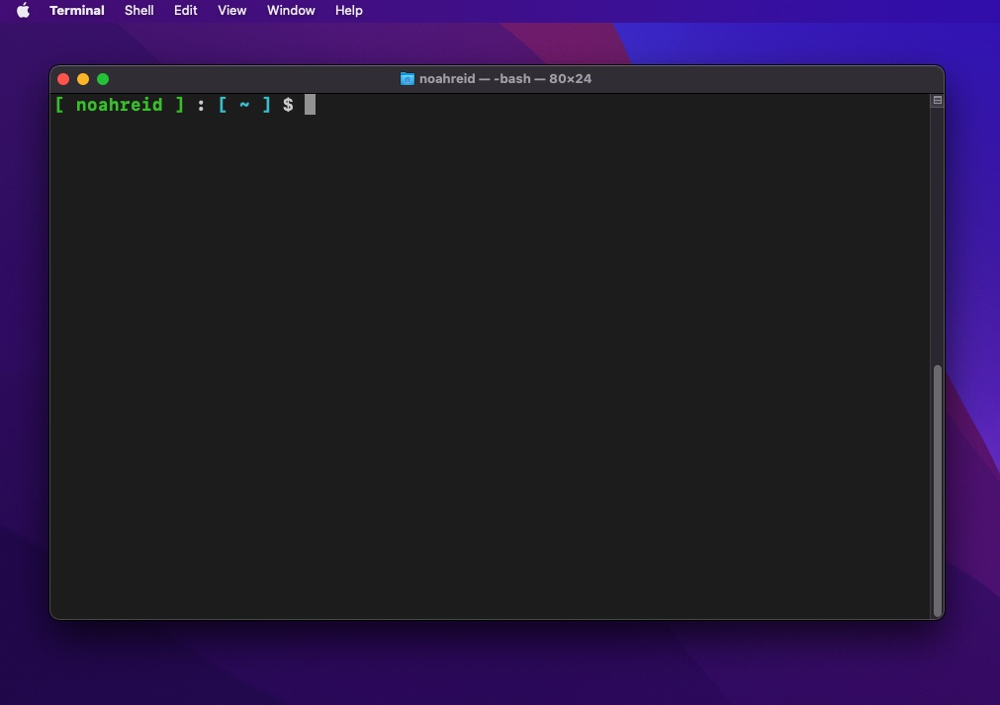
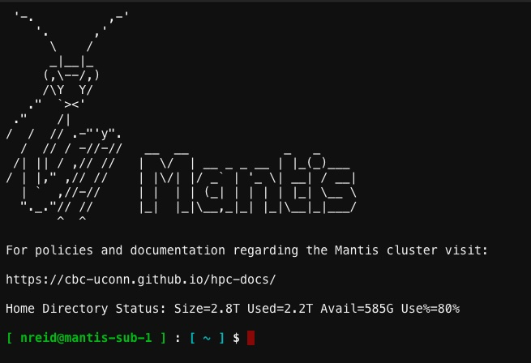

|                                                                       |
|-----------------------------------------------------------------------|
| **Learning Objectives:**                                              |
| Connect to the Mantis cluster                                     |
| Identify when a terminal window is connected to a remote computer |

## Objective

Our starting exercises, and indeed most of the work for the course, will take place on a remote computer cluster running a Linux operating system (the cluster is named `Mantis`). So the first thing you're going to do is connect your local machine to that server. We'll get into many of the details to help you understand what's going on later, but to start we're going to have you follow some directions without a lot of explanation.

You can connect to the server using a computer running Windows, MacOS, or any variety of Linux. We'll cover how to do it with a machine running Windows or MacOS here, and assume that if you are running Linux as your primary operating system, you are savvy enough that you can piece this together on your own (or ask an instructor for help).

We provide two primary ways to access HPC resources, terminal access via SSH and web-browser based access via Open OnDemand. Open OnDemand is simpler to use, but not very widespread, while terminal access using SSH is essentially universal. Early exercises will assume you are using a terminal application and some will not work in Open OnDemand, but as the course moves and you become comfortable with command-line work on you may switch between them as you see fit. 

Primary documentation for the [Mantis cluster](https://cbc-uconn.github.io/hpc-docs). 

## Prerequisites

1. You must have applied for and set up [a CAM account](https://cbc-uconn.github.io/hpc-docs/account.html), including DUO 2-factor authentication set up on a mobile device. See HuskyCT for the details to include in your application. 
2. You must have set up [SSH key authentication](https://cbc-uconn.github.io/hpc-docs/keys.html). For SSH access, *password* authentication is not allowed and we require SSH keys instead (more on this later). 

Setting up SSH keys and connecting are also covered in a video in HuskyCT. 

## Getting ready to connect with MacOS

Start by opening the app "Terminal" on your computer. It should already be installed. MacOS is a unix-like operating system (as is Linux) and as such, you can interact with it through the command-line in a terminal without installing any special software (again, more on this later). When you open a terminal, you'll see a mostly empty window with a **prompt**. The prompt will be a single symbol, probably a `>` or a `$`. Here is an example of a terminal with a customized prompt (giving the username and current working directory):



## Getting ready to connect with Windows

Connecting to a Linux-based cluster is a little more complicated on a machine running Windows than one running MacOS. There are a few different ways to do it, but our recommended approach is to use Windows Subsystem for Linux (WSL). WSL essentially allows a Windows machine to run Linux programs, and interact with the Linux operating system through a command-line terminal. Connecting to the cluster this way will mean that most future instruction will be identical, or nearly so, for Mac and Windows users.

WSL first needs to be installed. Instructions for that are [here](https://learn.microsoft.com/en-us/windows/wsl/setup/environment). There are different flavors of Linux: Debian, Ubuntu, CentOS, which Mantis runs on, and many others. the WSL default, Ubuntu, will be fine.

After you've installed WSL, you should open a Ubuntu terminal window. When you open a terminal, you'll see a mostly empty window with a **prompt**. The prompt will be a single symbol, probably a `>` or a `$`. Above is an example of a terminal with a customized prompt (giving the username and current working directory). 

## Connecting

You should now have a terminal window open. We're going to use SSH (*S*ecure *SH*ell protocol) to connect to Mantis. You should already have set up your Mantis account with a username and password (if not, see [here](https://health.uconn.edu/high-performance-computing/contact/)). The username is distinct from your netID, and is usually first initial, last name (i.e. the username for John Smith will often be *jsmith*).

To login type the following command at the prompt:

``` bash
ssh username@mantis.hpc.cam.uchc.edu
```

You should be asked if you want a Duo push:

```
Enter a passcode or select one of the following options:

1. Duo Push to XXX-XXX-6964

Passcode or option (1-1):
```

Enter `1` and then approve the connection you get from the Duo app on your mobile device. 

If you were successful and made no mistakes your terminal window is now connected to a remote computer (i.e. Mantis) and you should see a screen like this:



Again, this particular terminal prompt has been customized (we'll show you how to do that later) so your prompt won't look the same, but you have now logged in to the Mantis cluster.

### Breaking it down

Because this is our first command issued in the course, I want to break down what we did. When you typed `ssh username@mantis.hpc.cam.uchc.edu`, you used the fundamental command-line syntax `<command> <arguments>`. You told **your computer** to execute the program `ssh`, which allows you to securely gain command-line access to another computer, and provided the details ("arguments") `username@mantis.hpc.cam.uchc.edu`, which are your username, and the server address of the computer you want to connect to. When your computer reached out to Mantis with your user ID, Mantis sent back a message derived from the public SSH key you deposited there. `ssh` used your private key to interpret that message and send another back, confirming your identity. A Duo push was also triggered. When you also confirmed that, your identity having been established with two factors, the connection was established. 

I want to take a moment to emphasize something that might not be entirely clear yet, but which is very important. When you first opened your terminal window, any commands you wrote there were commands directed to and executed by **your computer**. After you ran `ssh` on your computer to connect to Mantis, your terminal window effectively became a terminal window on the **Mantis cluster**. Any subsequent commands you enter at the prompt will be received and executed by **Mantis**. It is as if you were actually sitting at a terminal physically connected to one of Mantis's nodes. Nothing you do at this terminal will impact your computer in any way, and *programs running on Mantis cannot directly access your local system or any of its files*. Conversely, nothing you do outside this terminal window will impact Mantis.

Unless you are told directly, all the work for the Linux and HPC sections of this course should be conducted on Mantis, after using `ssh` to connect.

Now, without a customized prompt, it will not always be obvious *what computer* a given terminal is connected to. if you're working in a terminal window and you're not sure about this, you can always enter the command `hostname`. If the output is something like `mantis-duosub-#`, `mantis-sub-#`, or `mantis-###`, then you're connected to Mantis. If it's anything else you're not! Try that now. This is especially useful because in some cases you may want to have multiple terminal windows open at a time. 

Ok, now that we're connected, this exercise is nearly over. You can disconnect by typing `exit`. You should see a message like this:

``` bash
logout
Connection to mantis-submit.cam.uchc.edu closed.
Your connection to the remote server has been terminated.
```

Type `hostname` to verify that you are working locally. Now any commands you type in the terminal will be executed by your computer. Alternatively, you can simply close the terminal window, and that will kill your connection to Mantis.

By now you've probably noticed the terms **remote** and **local** being used regularly. When we refer to doing something *locally*, we mean to do it on your personal computer, without connecting it to Mantis, whereas *remote* means the opposite. 

## Linux Commands in This Section
 
| Command | Description                          |
|---------|--------------------------------------|
| ssh     | initiates connection to a remote machine using secure shell protocol.     |
| hostname     | prints the name of the current system     |