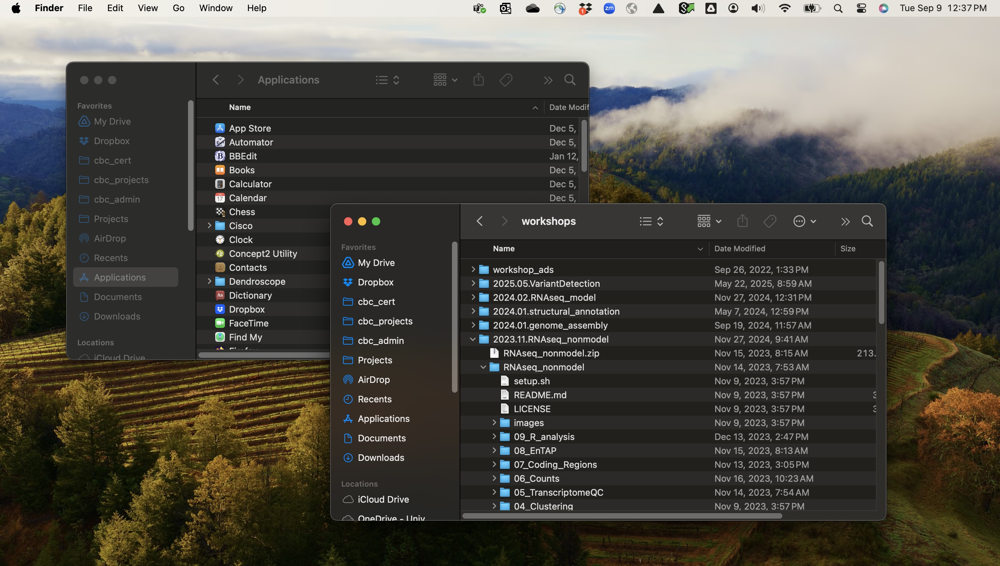
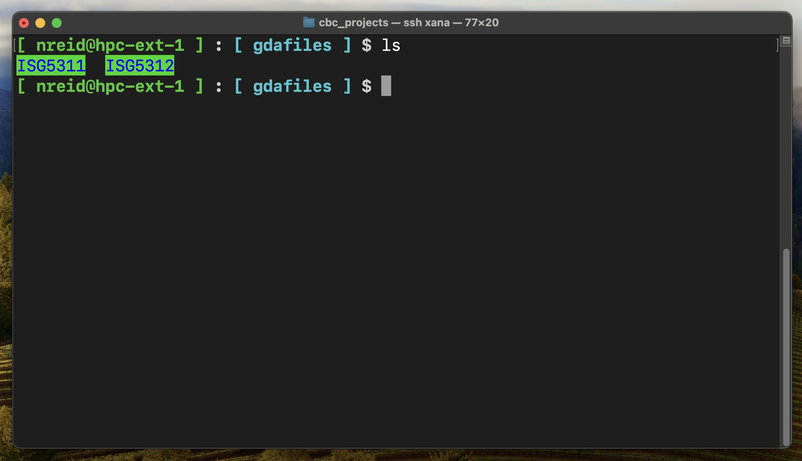

|                                                                       |
|-----------------------------------------------------------------------|
| **Learning Objectives:**                                              |
| Navigate the Linux file system using the BASH shell                                     |
| Manipulate files and directories |
| Modify file ownership and permissions |
| Use multiple strategies to get help and problem solve |
| Ask questions about the status of the system |

## The Linux operating system

As we have mentioned, this course will make heavy use of a high performance computing cluster running a **Linux operating system**. But what is Linux? [Linux](https://en.wikipedia.org/wiki/Linux) is an open-source computer operating system descended from an older operating system called [Unix.](https://en.wikipedia.org/wiki/Unix) There are lots of different flavors of Linux, referred to as **distributions**. 

The vast majority of cutting-edge research software is built in Linux environments, and can be relatively easily compiled on most distributions. MacOS is built on a different descendant of Unix, [BSD](https://en.wikipedia.org/wiki/Berkeley_Software_Distribution), which differs from Linux. Because of their shared ancestral design features, however, most software developed for use on Linux systems can be compiled and run on MacOS. To run Linux software on a Windows system, a good option is to install *Windows Subsystem for Linux*, which we asked you to do in the previous chapter if you are using Windows. Mantis runs on a Linux distribution called [Ubuntu](https://en.wikipedia.org/wiki/Ubuntu). This is occasionally important to know when compiling software. 

Linux distributions can have *graphical user interfaces*, but for scientific computing purposes, interacting with Linux through a **command-line interface** (sometimes abbreviated **CLI**) is nearly universal. 

## The shell and the operating system

While Linux is the **operating system** that runs the computer, command-line interaction with that operating system happens through another layer of software called a **shell**. A shell is essentially an application, like any other, that takes input from the user, passes it to the operating system to be processed, and then returns any output, warnings or errors. There are several commonly used command-line shells, including Z shell (zsh), TC shell (tcsh) and Bourne-Again shell (bash). These shells share many features in common, but in scientific computing, **bash** is most commonly used and is what we'll use here. Newer MacOS computers default to zsh (this can be changed), but zsh is an extension of bash that is mostly compatible with it, so bash scripts should work in zsh. 

**Try this now**: To find out what shell your local computer is running, open a terminal window and type `echo $SHELL` at the prompt. `echo` is a command that simply prints whatever input it receives and `$SHELL` is an environment variable (more about those later). The variable contains a character string, probably `/bin/bash` or `/bin/zsh`, depending on your operating system and if you have changed the defaults. If you log in to Mantis (remember: `ssh username@mantis.hpc.cam.uchc.edu`) and type the same command, it will say `/bin/bash`. 

Your interactions with the command-line shell will nearly always take the form of `<command> <argument1> ... <argumentN>` You've seen this twice now when you ran `ssh` and `echo`. Using the command line, you will issue commands to navigate the file system, to manipulate files, and to execute programs. 

## Navigating the file system

Now that we have learned a little about the Linux operating system and how to connect to a remote computer, a natural place to begin *interacting* with Linux is to learn how to navigate the **file system**. The file system organizes and tracks data stored on a computer. It keeps track of where files are on a storage device, how big they are, when they were created, which users own them, and many other things. 

These days, many people's primary experience with computers is through smartphones. Smartphones running the IOS and Android operating systems obscure and restrict access to the file system. On a smartphone, your entire interaction with the OS is through apps, of which the phone's graphical user interface (GUI) is one. For example, if you want to explore, edit, copy, or delete photos you've taken, you might use Google Photos, or some other specialized app. If you want to listen to music files you've downloaded, you might use Spotify. At no point do you, personally, have permission to manipulate any of these files directly. 


GUIs and CLIs on personal computers, on the other hand, often give you more flexibility in access to the filesystem. You might use a photo app to explore or edit photos on your laptop, but if you wished to copy, move, or delete a photo, you could do that yourself by navigating through the filesystem to the place the photo is stored and then directly act on the file through the operating system, rather than by asking a specialized app to do it for you. 

In a GUI, the file system itself is usually represented as a nested series of directories, graphically depicted as windows. You open the window for a directory, and inside you will see files and subdirectories, possibly in the form of a list, or maybe as a series of icons laid out in a grid. There are also likely to be directories which you can open up in new windows by pointing the mouse at them and double-clicking. You may have multiple windows open at once, but only one of these will be the window in which you are actively working. If you use a keyboard shortcut or menu option to create a new file or directory, that action will occur in the active window. 



In a Linux CLI, the file system is also represented by a hierarchical directory structure, where each directory contains files and often sub-directories. There is, however, typically no graphical visualization of that structure available. Though you cannot see that structure in the form of windows, you still have something analogous to the "active window" in a GUI, a *working directory*. If you issue commands that create or modify files or directories, their effects will by default occur in your current working directory. 



### Paths

When doing any kind of work in a Linux CLI, you'll need to be aware of what the current working directory is. There are two ways to access it. First, there is a simple command, `pwd` (for **p**rint **w**orking **d**rectory). Second, there is a built-in environment variable, `$PWD`. 

**Try this now:** Log in to Mantis and try entering `pwd` and `echo $PWD` now. Both will return something like the following: 

```bash
/home/FCAM/username
```

This is called a *path*. It gives the full sequence of enveloping directories for the current working directory, with each directory name separated by `/`, and ending in the current working directory with name `username`. The initial `/` refers to the *root directory*, which has no name and no parent directories. On our system, `home` is one of the directories found in root, `FCAM` is found inside `home`, and `username` is found inside `FCAM`. If you change your current working directory, the results of `pwd` and `echo $PWD` will change as well. 

Assuming you executed the above commands after logging in, and before doing anything else, *the particular path* you saw is pretty important. It is your **home directory**. Mantis, like most high performance computing clusters, has many users, and each has a home directory where only they have permission to make or modify files and directories. Because of the special status of this directory, it is also assigned a symbolic shortcut: `~`. 

**Try this now:** Type `echo ~`. No matter what your current working directory is, `~` will always be set to your home directory. 

Paths that begin with `/`, like `/home/FCAM/username` are referred to as **absolute paths** (or full paths), because they give the complete sequence of directories from the root to the target file or directory. There is no ambiguity about what an absolute path refers to on the file system. 

We can also specify paths **relative** to the current working directory. Let's say your current working directory contains a project directory, `killifishGenomes` with two subdirectories `rawdata` and `scripts` that looked like this:

```bash
killifishGenomes/
├── rawdata
└── scripts
```

The absolute path to the rawdata directory looks like this:

```bash
/home/FCAM/username/killifishGenomes/rawdata
```

If your current working directory is `~`, however, you can equally well specify the directory with paths that are *relative* to your working directory like this:

```bash
killifishGenomes/rawdata
```

or this:

```bash
./killifishGenomes/rawdata
```

where the `.` stands in for the current working directory. 

What if your current working directory is `scripts`, and you want to refer to `rawdata`? You can use `..`, to indicate the relative path goes *up* one level in the hierarchy before descending into another directory: 

```bash
../rawdata
```

Imagine our directory structure was a little more complex, like this:

```bash
killifishGenomes/
├── rawdata
│   ├── ont
│   └── pacbio
└── scripts
    ├── assembly
    └── QC
```

Say we are working in the directory `scripts/QC` and we want to point to a file in `pacbio`. The **absolute path** is `/home/FCAM/username/killifishGenomes/rawdata/pacbio` and the path **relative** to our current working directory is `../../rawdata/pacbio`, indicating the path ascends two levels in the directory hierarchy, then descends two levels to `rawdata/pacbio`

::: {.callout-note}
Relative paths can be useful in two ways. First, they are often much shorter than full paths, making scripts easier to read. Second, if you are working in a project directory that you need to move, perhaps from `/home/FCAM/username` to `/labs/principalinvestigator`, because you are running out of space in your home directory, scripts containing absolute paths (like `/home/FCAM/username/killifishGenomes/rawdata/pacbio`) pointing inside the project directory will break (i.e. point to locations in the file system that no longer exist), while those with relative paths (like `../../rawdata/pacbio`) will still function.
:::

### Changing the working directory

All of the above discussion of paths and working directories raises the question: How do I change my working directory? The answer is to use the command `cd`, which takes a single argument: the directory you wish to move into. 

**Try this now:** Making sure you are logged in to Mantis, try changing to the root directory, then type `pwd`:

```bash
cd /
pwd
```

Remember, `/` refers to the root. Now let's navigate to your home directory one step at a time, typing pwd after each step:

```bash
cd FCAM
pwd
cd username
pwd
```

If you forget where your home directory is, remember the shortcut `~`. `cd ~` will always take you home. 

You can use both relative and absolute paths to change directories, as we discussed above. 

### Listing directory contents

A downside of command-line navigation of the filesystem is that you don't immediately see directory contents as you do in a GUI with windows. For that, we use the command `ls`. Since we are just getting started, your home directory on Mantis is probably empty, so if you go there and type `ls`, you should get no results. 

Let's go somewhere more interesting. 

**Try this now:** List the contents of the directory `/isg/shared/mantis/apps/`. You can do this one of two ways. Without changing the working directory, and supplying a target directory as an argument to `ls`:

```bash
ls /isg/shared/mantis/apps/
```

Or you can move to that directory and type `ls` with no arguments:

```bash
cd /isg/shared/mantis/apps/
ls
```

The directory contents should be a very large list. This directory contains a subdirectory for each globally installed (i.e. available to all users) software package on Mantis. Each subdirectory contains yet more subdirectories for each version of the package installed. Let's look more closely at `iqtree`, a package used for phylogenetic inference. 

```bash
cd /isg/shared/mantis/apps/iqtree/
ls
```

At the time of writing, there were two subdirectories, corresponding to two package versions:

```bash
3.0.0  3.0.1
```

Let's visit `3.0.1` and have a closer look:

```bash
cd 3.0.1
ls
```

You should see:

```bash
bin  example.cf  example.nex  example.phy  models.nex
```

Ok, great. We see some things in this directory, but can't we learn a little more about them? Yes, by supplying some arguments to `ls`. 

The first let's try the argument `ls -l`. This will give you the *long form* directory listing, which looks like this:

```bash
total 2364
drwxr-xr-x 2 root root    1536 May  5  2025 bin
-rw-r--r-- 1 root root 2237314 May  5  2025 example.cf
-rw-r--r-- 1 root root     174 May  5  2025 example.nex
-rw-r--r-- 1 root root   34178 May  5  2025 example.phy
-rw-r--r-- 1 root root  121669 May  5  2025 models.nex
```

We won't cover all this in detail just yet, but some key information is 

* Column 1: The file permission string. The first letter (`d` or `-`) tells you whether the item is a directory or a regular file. 
* Column 5: The file size (in bytes).
* Column 6,7,8: The file modification date. 

For easier-to-read file sizes, supply a second argument `ls -l -h` or the more abbreviated combination of arguments `ls -lh`. 

```bash
total 2.4M
drwxr-xr-x 2 root root 1.5K May  5  2025 bin
-rw-r--r-- 1 root root 2.2M May  5  2025 example.cf
-rw-r--r-- 1 root root  174 May  5  2025 example.nex
-rw-r--r-- 1 root root  34K May  5  2025 example.phy
-rw-r--r-- 1 root root 119K May  5  2025 models.nex
```

Now the file sizes have a suffix indicating the unit (K = kilobytes, M = megabytes, G = gigabytes)

There are a few more arguments that may come in handy:

* `-t` sorts the listing by modification date
* `-R` lists *recursively*, meaning it will also list the contents of subdirectories. 

I want to introduce another concept here, the *glob* : `*`. This symbol serves as a *wildcard* when referring to files and directories. If you want to list only the files in the directory beginning with "example" you can type `ls -lh example*`

```bash
-rw-r--r-- 1 root root 2.2M May  5  2025 example.cf
-rw-r--r-- 1 root root  174 May  5  2025 example.nex
-rw-r--r-- 1 root root  34K May  5  2025 example.phy
```

You can use multiple globs, if necessary. `ls -lh *l*` will output every element containing the letter "l". 

```bash
-rw-r--r-- 1 root root 2.2M May  5  2025 example.cf
-rw-r--r-- 1 root root  174 May  5  2025 example.nex
-rw-r--r-- 1 root root  34K May  5  2025 example.phy
-rw-r--r-- 1 root root 119K May  5  2025 models.nex
```

::: {.callout-note}
There is one more way of looking at directory contents, but it's not available on all systems: `tree`. It will print a nicely formatted visualization of directory structures. Try it. You should see:

```bash
.
├── bin
│   └── iqtree2
├── example.cf
├── example.nex
├── example.phy
└── models.nex

1 directory, 5 files
```
For complex directories you can supply the argument `-L` and a number to specify the number of directories deep the listing should go. 

Update: `tree` was available on our old cluster, Xanadu, but is not installed by default on Mantis. Maybe we'll try to remedy that...
:::

### The `find` command

It's often the case that you will want to find files in a large and complicated directory. Linux does not have an indexed search feature like Spotlight in MacOS, so if you're looking for files by name, or content within files you'll need other strategies. Here we'll discuss how to find files by name using `find`. 

`find` is an extremely flexible utility included with Linux. It allows searching for files within a specified directory on combinations of attributes such as name, modification date, size, owner and more. Here we'll just cover the simple case of searching by name. The most basic usage of find is `find <path to search> <expression>`. The expression we're going to use is `-name "matchpattern"`. The match pattern can use one or more globs as a wildcard. 

**Try this now**: We can search for all files with the suffix `fq.gz` in the directory `/core/cbc/tutorials/workshopdirs/RADseq_tutorial_grayling_2026/data/demux/` like this:

```bash
find /core/cbc/tutorials/workshopdirs/RADseq_tutorial_grayling_2026/data/demux/ -name "*fq.gz"
```

Find needs to traverse all the subdirectories of a target, so in a very large and complicated project, it can be somewhat slow. 

Note that `find` does not output results in any particular order, so don't rely on that in any code you write. 

## Manipulating files and directories

We have seen some basic ways to navigate the file system. Now we're going to start looking at how to examine and manipulate files and directories. 

### Creating directories

We're going to start with the basics of creating things and moving them around, and worry about the contents of files later. 

**Try this now:** To start, let's create a series of directories and populate them with (empty) files as a demonstration. Make sure you are logged in to Mantis and in your home directory (remember `hostname` and `pwd` to check if you're not sure). Enter the following commands at the prompt:

```bash
mkdir killifishGenomes
mkdir killifishGenomes/scripts
mkdir killifishGenomes/rawdata
mkdir killifishGenomes/results
```

The command `mkdir` creates a directory with the name you provide. This will create a directory structure like this:

```bash
killifishGenomes/
├── rawdata
├── results
└── scripts
```

You can create multiple directories in a single command by providing multiple arguments. Perhaps the most succinct way of creating all these directories at once is with a **shell expansion**. This is a feature of the bash shell that allows lists or ranges of values to be expanded. Let's first `echo` some shell expansions just to see what it looks like. Enter the following on the command line:

```bash
echo {a..z}
echo {1..10}
echo {scripts,rawdata,results}
echo killifishGenomes/{scripts,rawdata,results}
```

So, to create all these directories with `mkdir` you could simply have written:

```bash
mkdir -p killifishGenomes/{scripts,rawdata,results}
```
The `-p` flag means to create any parent directories in the path as needed. 

::: {.callout-note}
Let's briefly introduce you to some errors. 

Try the following, typed **exactly**:

```bash
mkdir mish/mash
```

You got an error, right? Which argument above could have solved this for you?

Now try this, typed **exactly**

```bash
mkdir -p mish /mash
```

You should have gotten another error. The space means `mish` and `/mash` are two separate arguments. `mkdir` created `mish` with no problem (try `ls` and you'll see), but `/mash` couldn't be created because regular users don't have permission to write in the root directory, which, if you remember, is signified by a leading `/` on any path. 

This being the beginning of your journey into bash and Linux, you will encounter many, many errors. We'll talk more about them later. 
:::

### Creating files

There are several ways that files can be created. A very simple way is by redirecting output into a new file. 

**Try this now:** Let's use the directory structure you created above to do this. Assuming you created the directory `killifishGenomes` in your home, and your home is your current working directory:

```bash
echo "This is a test directory" >killifishGenomes/README.md
```

This will write the text you `echo`ed to the file `README.md`. The `>` symbol redirects output to a file. If the file already exists, it will be *overwritten*. We'll talk in more detail about that later. 

You can *append* new lines to that file with `>>`:

```bash
echo "There aren't actually any genomes in here" >>killifishGenomes/README.md
```

We're going to cover more on inspecting files later, but for now, check that your commands were successful by using the command `cat`, which will write the contents of the file to the terminal:

```bash
cat killifishGenomes/README.md
```

We can also create empty files using the command `touch`. I don't use `touch` often, except in demonstrations like this. You can create many files using shell expansions:

```bash
touch killifishGenomes/scripts/{QC,assembly}.sh
touch killifishGenomes/rawdata/sample{1..5}.fastq.gz
touch killifishGenomes/results/sample{1..5}.fasta
```

Note that above we used a range of numbers in our shell expansion, `{1..5}`, to create 10 empty files. Shell expansions can also be used with letters, e.g. `{a..z}`. Check to see that the files are where you expect them to be using `ls`. 

If you've been following along so far, you can also try typing `tree killifishGenomes` or `ls -lh killifishGenomes/*`. You should see this structure:

```bash
killifishGenomes/
├── rawdata
│   ├── sample1.fastq.gz
│   ├── sample2.fastq.gz
│   ├── sample3.fastq.gz
│   ├── sample4.fastq.gz
│   └── sample5.fastq.gz
├── README.md
├── results
│   ├── sample1.fasta
│   ├── sample2.fasta
│   ├── sample3.fasta
│   ├── sample4.fasta
│   └── sample5.fasta
└── scripts
    ├── assembly.sh
    └── QC.sh
```

### Moving and copying

You will often need to move or copy files and directories within a system. There are two key commands we use for these tasks: `mv` for moving, and `cp` for copying. 

Let's say you've written some scripts, but you can see that as your project grows, your scripts directory is going to become crowded and feel disorganized. One solution is to moves scripts into subdirectories. `mv` takes two arguments: a path to a source file or directory, and a path to a destination directory. 

**Try this now:** From your home directory type:

```bash
mkdir -p killifishGenomes/scripts/{assembly,QC}
mv killifishGenomes/scripts/assembly.sh killifishGenomes/scripts/assembly
mv killifishGenomes/scripts/QC.sh killifishGenomes/scripts/QC
```

You can optionally rename things as you move them. If you wanted to rename the `QC` directory, you can simply append a new name to the path. Try it now:

```bash
mv killifishGenomes/scripts/QC killifishGenomes/scripts/quality_control
```

If you've followed these steps, your directory structure will now look like this:

```bash
killifishGenomes/
├── rawdata
│   ├── sample1.fastq.gz
│   ├── sample2.fastq.gz
│   ├── sample3.fastq.gz
│   ├── sample4.fastq.gz
│   └── sample5.fastq.gz
├── README.md
├── results
│   ├── sample1.fasta
│   ├── sample2.fasta
│   ├── sample3.fasta
│   ├── sample4.fasta
│   └── sample5.fasta
└── scripts
    ├── assembly
    │   └── assembly.sh
    └── quality_control
        └── QC.sh

5 directories, 13 files
```

Copying works similarly to moving, but the original copy of the file or directory remains in place. You provide a source file or directory and a destination. You can rename as you copy as well. Let's move to the scripts directory for this step and try copying some things:

```bash
cd killifishGenomes/scripts
cp assembly/assembly.sh assembly/assemblyV2.sh
cp assembly assembly_flye
```

You should have seen an error when trying to copy the directory `assembly`. To copy an entire directory you need to use the flag `-r`:

```bash
cp -r assembly assembly_flye
```

Your scripts directory should now look like this:

```bash
├── assembly
│   ├── assembly.sh
│   └── assemblyV2.sh
├── assembly_flye
│   ├── assembly.sh
│   └── assemblyV2.sh
└── quality_control
    └── QC.sh
```

::: {.callout-warning}
If you copy, move or rename a file, and a file with that name already exists at the destination, **the pre-existing file at the destination will be overwritten**. 
:::

### Removing things

Here is where things start to get a bit dangerous. To permanently delete files in a GUI like MacOS or Windows, you usually must take several very explicit, specific actions, and the OS often asks you if you're certain you want to. This is not the case in CLI Linux. 

In Linux we have a simple command, `rm`, which takes as its main arguments the items to be deleted. It's a single step, and there are in most cases no warnings issued. The simplest cases are `rm myfile.txt` to remove a single file, or to remove a directory `rm -r mydirectory`. `rm` can accept multiple arguments as `rm -r myfile.txt mydirectory`, and it can accept the glob (`*`) as a wildcard. 

Let's try this out now. We'll move to our home directory, copy our `killifishGenomes` directory, and then work on removing some things. 

```bash
cd ~
cp -r killifishGenomes killifishGenomesCopy
rm killifishGenomesCopy/scripts/assembly/assemblyV2.sh
rm -r killifishGenomesCopy/scripts/assembly_flye
rm -r killifishGenomesCopy/results/*fasta
```

After removing these files and one directory the structure should look like this:

```bash
killifishGenomesCopy/
├── rawdata
│   ├── sample1.fastq.gz
│   ├── sample2.fastq.gz
│   ├── sample3.fastq.gz
│   ├── sample4.fastq.gz
│   └── sample5.fastq.gz
├── README.md
├── results
└── scripts
    ├── assembly
    │   └── assembly.sh
    └── quality_control
        └── QC.sh

5 directories, 8 files
```

::: {.callout-warning}
### SERIOUSLY, READ THIS. 
**Don't execute any code in this box**

Because `rm` can accept multiple arguments and the glob as a wildcard, certain kinds of typos can be **very damaging**. You may want to remove all the files in a given directory like this:

```bash
rm /path/to/garbage/*
```
But if you mistakenly type this:

```bash
rm /path/to/garbage/ *
```
`rm` will refuse to remove directory `garbage` and give you an error (because you didn't supply `-r`) and then go on to **remove every single file in your current working directory** because it interprets the wildcard as a second independent argument which matches *everything*. 

If you accidentally type:

```bash
rm / path/to/garbage/*
```

then `rm` may or may not be able to remove the files in `path/to/garbage`, depending on if the current working directory contains the path, but the single `/` followed by a space means `rm` **will also try to delete every file in the root directory**. This would be **very bad** because important system files are there. 

Supplying `-r` amplifies the damage done by these typos. 

**Everyone who has been working at the command line long enough has a horrible story about making a mistake with `rm`, so be very cautious when using it.**

:::

## Ownership and Permissions

A pervasive feature of Linux, and one that causes many beginners headaches is the permission system. Most common operating systems that manage multiple users (i.e. Windows and MacOS) manage user access to files and directories invisibly, creating walled off areas of the file system for different users. 

Things work a bit differently in Linux. Permissions for files and directories are set explicitly on a case by case basis. Earlier we saw a permission string when we did `ls -l`. When I do this I see

```
drwxr-xr-x  5 nreid cbc          2.0K Dec 18 14:27 killifishGenomes
```

The first field in this output (`drwxr-xr-x`) is the permission string. It is always 10 characters. The first letter, `d` is the file type. It is `-` for regular files and `d` for directories. The following letters come in groups of three. The groups of three correspond to the permission types for three sets of users: the user owner (`u`) of the file, the user group (`g`) the file is assigned to, and every other user on the system (`o`). The permission types are, in order, "read" (`r`), "write" (`w`), "execute" (`x`). If a given permission is *not granted* to a given set of users, that character will be `-` instead of `r`, `w`, or `x`. 

So the permission string above broken down:

- `d`: `killifishGenomes` is a directory. 
- `rwx`: The user who owns the directory, `nreid`, has read/write/execute permission (characters 2-4). 
- `r-x`: The user group `cbc` has read and execute permission, but *not* write (characters 5-7).
- `r-x`: The rest of the users on the system also have read and execute permission (characters 8-10). 

A few notes about this:

1. This is a directory, so execute permission may seem somewhat nonsensical. You can execute a program (or a script), but not a directory. In this case it allows you access to see the list of files in the directory and their metadata. If you have read, but don't have execute permission, you can `cd` into the directory, but you can't do anything inside the directory, including listing the directory contents. 
2. This directory is inside my home directory, where I am the only user with any permissions at all, therefore, per point one above, even though other users nominally have read and execute access, they effectively do not. 

### Changing permissions

We use `chmod` to change permissions. There are two ways to change permissions. We're going to learn the easy, more verbose one. To give yourself (`u`), a user group (`g`) or all other users (`o`) read, write, or execute access to a file or directory, you can specify one or more of these sets as a string, and then add `+`, or remove `-` one or more permission types as a string. For example, to give everyone full access, you can do `chmod ugo+rwx filename`. To take away write access from everyone (locking up raw data like this is always a good idea so nobody accidentally deletes it) `chmod ugo-w filename`. To apply a permission string recursively to all files and subdirectories in a directory, you can simply add `-R` as in `chmod -R ugo+rx mydirectory`. 

**Try this now:** Take away all permissions for the group and the rest of the system users on the directory `killifishGenomes` and all its subdirectories. 

```bash
chmod -R go-rwx killifishGenomes
```

If you do `ls -l` you should see:

```
drwx------  5 nreid cbc          2.5K Apr  4 16:51 killifishGenomes
```

And for `ls -l killifishGenomes/*`:

```
-rw------- 1 nreid cbc          67 Dec 18 14:27 killifishGenomes/README.md
-rw------- 1 nreid wegrzynlab    5 Apr  4 16:51 killifishGenomes/test.txt

killifishGenomes/rawdata:
total 20
-rw------- 1 nreid cbc 0 Dec 18 14:27 sample1.fastq.gz
-rw------- 1 nreid cbc 0 Dec 18 14:27 sample2.fastq.gz
-rw------- 1 nreid cbc 0 Dec 18 14:27 sample3.fastq.gz
-rw------- 1 nreid cbc 0 Dec 18 14:27 sample4.fastq.gz
-rw------- 1 nreid cbc 0 Dec 18 14:27 sample5.fastq.gz

killifishGenomes/results:
total 20
-rw------- 1 nreid cbc 0 Dec 18 14:27 sample1.fasta
-rw------- 1 nreid cbc 0 Dec 18 14:27 sample2.fasta
-rw------- 1 nreid cbc 0 Dec 18 14:27 sample3.fasta
-rw------- 1 nreid cbc 0 Dec 18 14:27 sample4.fasta
-rw------- 1 nreid cbc 0 Dec 18 14:27 sample5.fasta

killifishGenomes/scripts:
total 12
drwx------ 2 nreid cbc 1024 Mar  5 11:06 assembly
drwx------ 2 nreid cbc 1024 Mar  5 11:07 assembly_flye
drwx------ 2 nreid cbc  512 Mar  5 10:59 quality_control
```

### Changing groups

For any file you own, you can change the group to any user group you are a member of using `chgrp`. To first see the groups you are a member of type `groups username` (but use your username). For example, I am a member of `reidlab` and `cbc`. I can change this directory (and all its contents recursively) from `cbc` to `reidlab` with `chgrp -R reidlab killifishGenomes`. 

## Getting Help

Perhaps you're getting the impression that working at the command line is going to require mastery of many, many small details. To a degree this is true. Fortunately, there are lots of ways to get help.

### Built-in help

The most basic way to get help with a program is to try to get the program itself to print its *usage*. That is, you can ask the program to write how it should be used, and a brief description of its command line arguments. One or more of the following approaches will usually work:

1. Entering the command with no options: `<command>`
2. Entering the command with the flag `-h`: `<command> -h`
3. Entering the command with the flag `--help`: `<command> --help`

Most programs will likely print the usage with one or more of these approaches. 

Another form of built-in help are manual, or `man` pages. Not every program has a `man` page, but most programs included as part of a Linux distribution will. To access a `man` page, enter `man <command>`. The documentation will display interactively. To exit the man page and return to the shell prompt, type `q`. 

Try these approaches for the commands `find` and `cat`. **Note**: `cat` with no options will drop you into an interactive session with cat. To kill the process and get back to the prompt, try typing `ctrl-.` or `cmnd-x`. 

### The Internet! 

There are **tons** of resources available on the internet for learning Linux and the bash shell, troubleshooting particular commands, and accomplishing specific common tasks. Good places to look are:

1. [The bash manual](https://www.gnu.org/software/bash/manual/bash.html)
2. [Introduction to Linux](https://tldp.org/LDP/intro-linux/html/)
3. [stack overflow](https://stackoverflow.com) - a community where users can ask and answer questions on a variety of topics. 
4. [unix stack exchange](https://unix.stackexchange.com) 

But there are many sites, ranging in quality and focus that can help you figure out answers to questions. Even advanced users regularly consult pages like this and search google for help. 

### AI/large language models

Since 2022, the emergence of large language models like [chatGPT](https://chat.openai.com) has been transforming how we do work in bioinformatics. These models allow users to ask questions and receive answers in natural language, and they are remarkably adept at producing and interpreting code, at least for relatively straightforward tasks. They can dramatically increase the speed at which experienced users can produce code, and help elevate the abilities of new users. 

For a simple example of how you can get help, visit [Chat GPT](https://chatgpt.com/) and try this question: "In bash, how can I use the find command to find all files in a given directory created since 2022?"

::: {.callout-warning}
We (hesitantly) encourage the use of LLMs as an aid for writing code and navigating the command-line in this program. They can help you focus in on something you don't understand, or point you toward ideas or resources that can help you learn, but which you weren't finding through a traditional search engine. 

There are a few pitfalls, however:

1. LLMs can shortcut your learning. This is not an AI-first program. We think you should know how to do this stuff on your own. Experience doing this work yourself will help you develop critical intuition and the ability to *discern* good work from bad. If you lean heavily on LLMs to produce work you don't understand you may get through this program, but you will be unprepared to do good work in your future endeavors and it will show. 
2. LLMs are *frequently wrong*. It is incredibly common for LLMs like ChatGPT or Claude to suggest command-line options for software that do not exist in a current version of the software, have never existed, or exist but do not do the thing the LLM says. Even worse, not all incorrect suggestions will result in errors. You cannot simply trust them to get things right on their own. 
3. LLMs, even when suggesting technically correct solutions, may suggest inefficient or otherwise problematic things. An LLM may suggest you use a piece of software that is outdated and effectively abandoned by its developers. An LLM may suggest a statistical approach with a theoretical basis that is inappropriate for real world data. For example (as of 2024), if you ask ChatGPT for code to calculate the variance from a sample, it will give you code for a standard statistics textbook equation for estimating variance. This method is subject to [numerical instability](https://en.wikipedia.org/wiki/Numerical_stability), however, and will yield inaccurate estimates under some circumstances. If you know enough to *ask* ChatGPT about the numerical stability issue, it will immediately suggest fixes, but we don't always know what we don't know. 


When using LLMs, students should:

- Understand exactly what any suggestions or code are doing, down to the last detail.
- Verify that any suggestions or code are correct by checking documentation or published literature, as appropriate. 
- Validate any suggestions with testing rather than trusting them. 

:::

## Asking questions about the system

**What is the name of the system you are on now?** Try `hostname`. On a computer cluster like Mantis this is really important. There are many different nodes. Sometimes a job will fail as a result of a problem with the system rather than some kind of user error. It's good to know when troubleshooting which one you were using. 

**Which Linux distribution and kernel version is your system running?** Try `hostnamectl` (or `hostinfo` on a local MacOS machine). 

**How much memory is available on this system?** Try `lsmem` or `cat /proc/meminfo` for a detailed view. You'll note that as you're likely on a login node, the memory available will not be impressive (something like 8 gigabyges). 

**How many and which CPUs are on this system?** Try `lscpu` or `cat /proc/cpuinfo`. From `lscpu`, the total number of CPUs (or cores) on the system is the number of sockets times the number of cores per socket. On the login node that will probably be something paltry like 8. 

**What processes are currently running on the system?** Try `top`. This is a list of running processes. To sort by CPU usage, type `shift-p`. To sort by memory usage type `shift-m`. Since you're most likely on a login node (rather than a heavy duty compute node), hopefully you will not see any processes using a substantial percentage of CPU or memory. Type `q` to quit. You can also use `ps aux`. 

**How long and how intensively has the system been used?** Try `uptime`. Per the man page, `uptime` will tell you how long the system (the machine you are currently logged into, not an entire cluster) has been running, how many users are currently logged on, and the system load averages for the past 1, 5, and 15 minutes. Note that "Load averages  are  not normalized for the number of CPUs in a system, so a load average of 1 means a single CPU system is loaded all the time while on a 4 CPU system it means it was idle 75% of the time."

**How full are available storage systems?** Try `df -h`. This should give the total amount of storage on each system and how much is currently used. Mantis has several network-attached file systems (NFS). Some of them don't mount and thus won't be visible to the command unless you visit them first (e.g. `cd /seqdata`). Hopefully none are too close to full...

**How much space is a given directory using?** We've seen that `ls -l` can tell us how much disk space a file uses, but it won't sum everything up for a whole directory. Try `du -sh`. This will give you an accounting of the space used in your current working directory. To tally up each directory in the current working directory individually, try `du -sh *` or for a specific directory `du -sh killifishGenomes`. 

**Which other users are logged in to this system?**: Try `who`. Mantis has many login and compute nodes. This list is only users who are currently logged in (though they may be idle). 

**Which groups does a user belong to?** Try `groups <username>`. Try your own username

**Which users belong to a group?** Try `getent group <groupname>` (try `cbc` for Computational Biology Core and associated faculty and staff). 

## Basic Linux Commands

| Command | Description                          |
|---------|--------------------------------------|
| pwd     | print working directory              |
| cd      | navigate through directories         |
| ls      | list directories                     |
| find    | search for files                     |
| echo    | print arguments to standard out.     |
| mkdir   | create directory                     |
| mv      | rename or move files                 |
| cp      | copy files or directories            |
| touch   | create empty file                    |
| cat     | display file contents or concatenate |
| rm      | delete files or directories          |
| man     | get help                             |
| less    | display paged outputs                |
| chmod   | change file permissions              |
| wget    | download files from the internet     |


## Exercises

See Blackboard Ultra for this section's exercises. 


