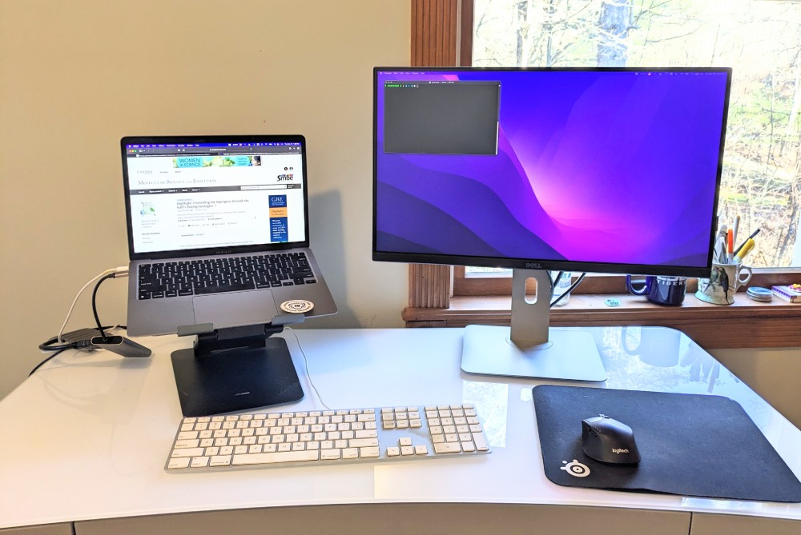

# Preface {.unnumbered}

This course is focused on imparting practical knowledge of how to conduct bioinformatic analyses, with a focus on teaching users to interact with computers using a command-line interface. The initial parts of the course will introduce you to the Linux operating system, the BASH shell, and how to access and schedule work on a high performance computing cluster. We will move from there to understanding sequencing data and exploring ways to manipulate and summarize it. Finally, we will explore a very common workflow, differential expression with bulk RNA-seq, as a model for how to organize and conduct an analysis project. In the last stage we will also introduce the R statistical computing language, and use differential expression analysis as a vehicle for learning about data visualization. 

## Materials necessary for the course

You will need a laptop or desktop computer running a Windows, MacOS or Linux operating system. Most machines produced in the last few years will be sufficient because heavy computation will be done on a powerful remote computer cluster. 

You'll be working at your a computer a lot during this course, often simultaneously using multiple applications, so it will be helpful to have the right setup. Screen real estate is an important factor. If you're working at a desktop, the bigger the display(s) the better. If you are using a laptop, we recommend a desk space with a second display, mouse and keyboard, if possible. Something like this:

